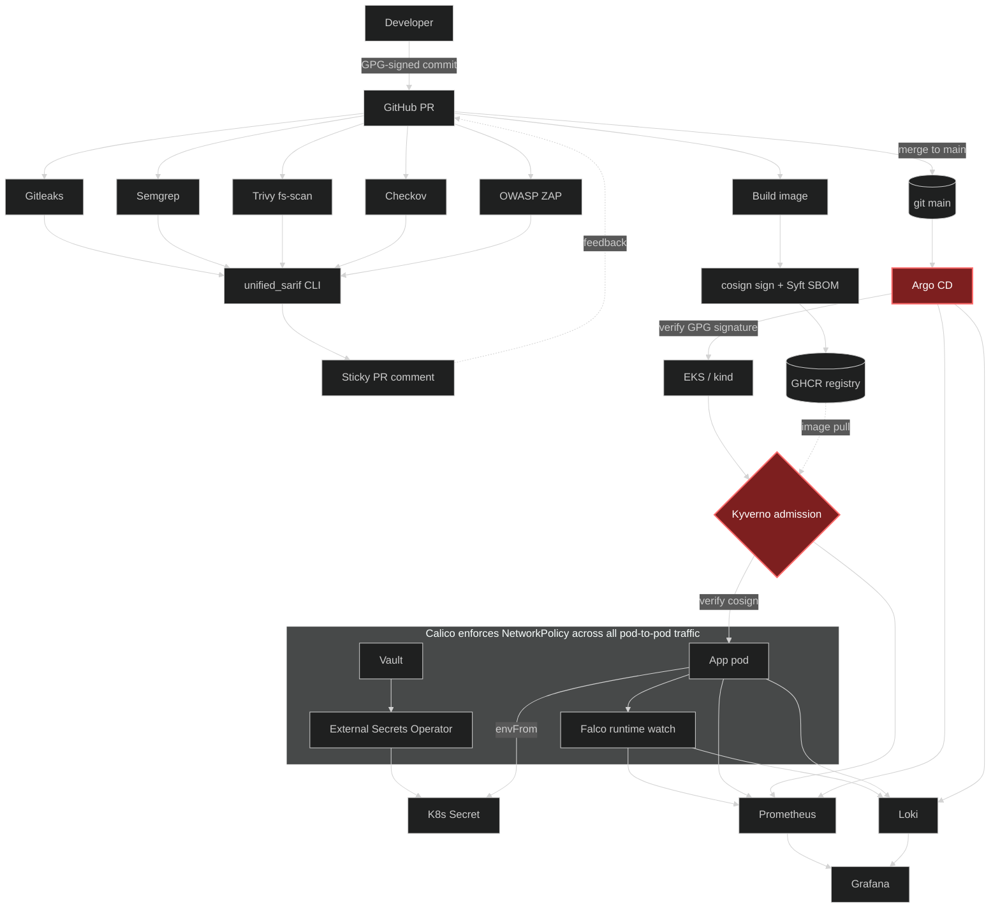
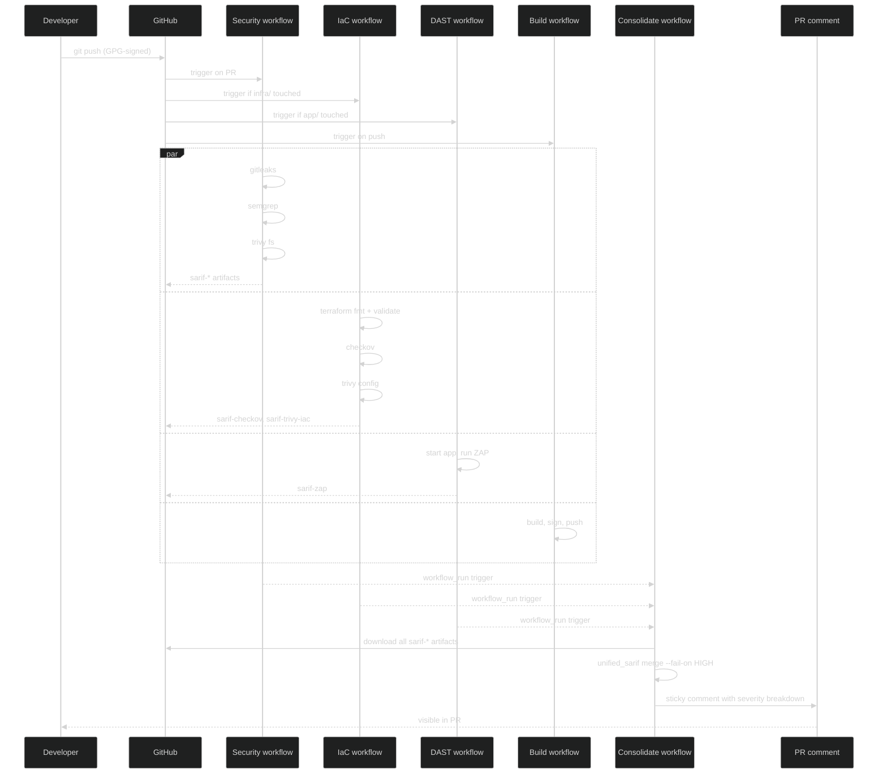
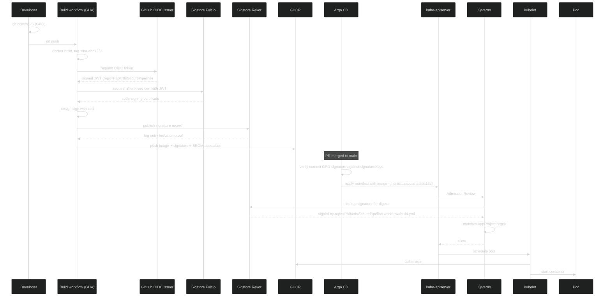
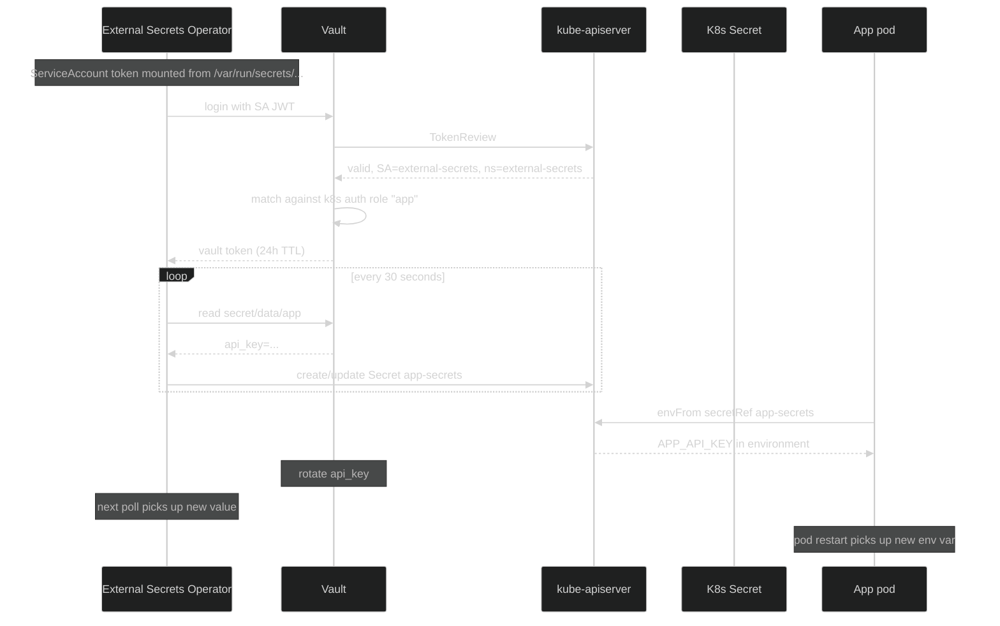
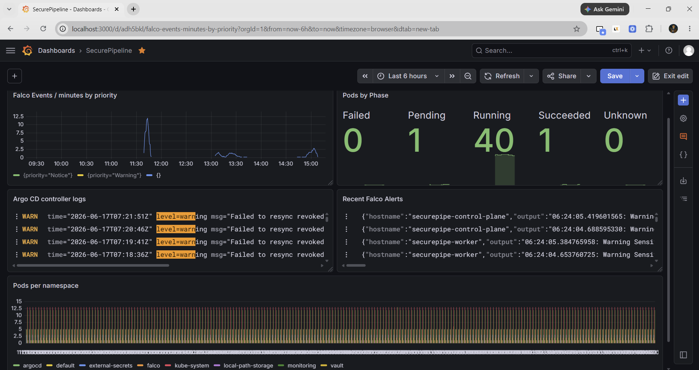
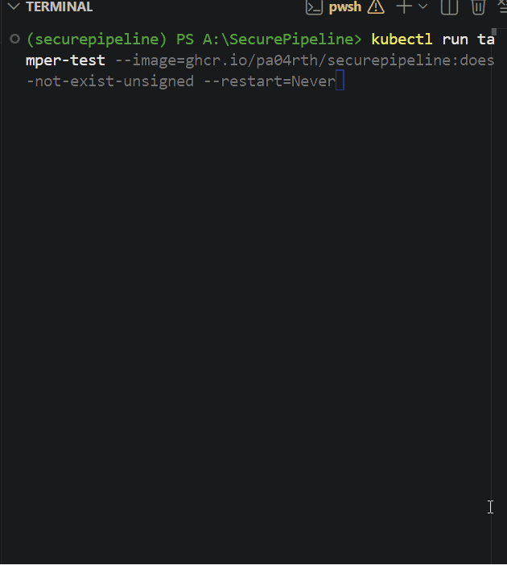
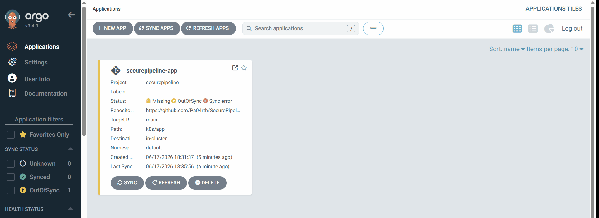
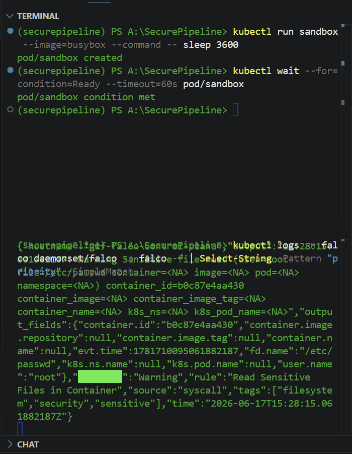
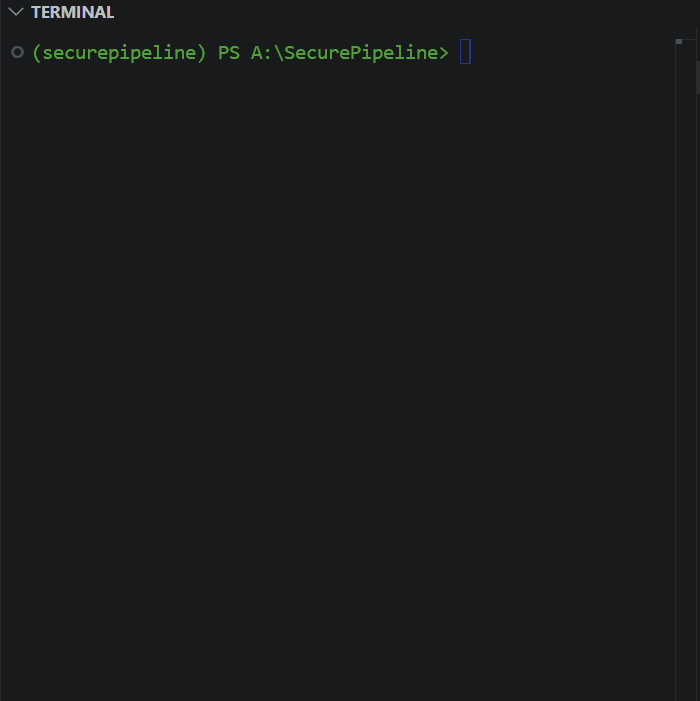

# SecurePipeline

A reference DevSecOps platform that wires together the security controls a typical CI/CD pipeline misses one at a time. Built around a sample FastAPI service, every stage from commit to runtime carries an enforced gate, every artifact is signed, every secret is fetched from Vault at runtime, and every event lands in one Grafana pane.

**Full writeup with mental-decision notes and architecture details:** [`https://www.parthsohaney.online/blog`](https://www.parthsohaney.online/blog)

It runs locally on `kind` for development and is provisioned for AWS EKS via Terraform. None of this is novel research — what is here is _thirteen layers wired so they reinforce each other instead of fighting each other_.

---

## The gap this fills

Most "DevSecOps" portfolio projects run one Trivy scan in GitHub Actions and call it done. That covers maybe ten percent of what a real platform engineer is asked to build. Production security is **defense in depth** — five tools at commit time, three at build time, two at admission, two at runtime, one watching the network. The engineering is not picking the tools. It is wiring them together so they do not cancel each other out and so the failure of any one of them does not silently let bad code through.

SecurePipe is the end-to-end version of that wiring. Every layer below was added because the layer above could not catch what comes next.

---

## What is in here

The platform integrates the following controls, grouped by lifecycle phase:

**Commit time**

- Secret detection with Gitleaks
- Static application security testing with Semgrep
- Software composition analysis with Trivy (filesystem mode)

**Build time**

- Multi-stage Docker build to a non-root runtime image
- SBOM generation with Syft (CycloneDX)
- Keyless image signing with cosign and Sigstore, signatures published to the Rekor transparency log
- Image published to GitHub Container Registry

**Infrastructure as Code**

- AWS EKS provisioned via Terraform using `terraform-aws-modules`
- IaC scanning with Checkov and Trivy config-scan
- KMS-encrypted secrets, IRSA, VPC flow logs, IMDSv2 enforced

**Dynamic application security testing**

- OWASP ZAP baseline scan against the running app
- Custom Starlette middleware to fix the security headers ZAP flagged

**Findings consolidation**

- A custom Python CLI (`unified_sarif`) that normalises SARIF output from six scanners into one sticky pull request comment

**Admission control**

- Kyverno `ClusterPolicy` with `verifyImages` rejecting any container image not signed by the SecurePipe CI workflow
- Keyless attestor scoped to the specific workflow path on this repository

**Secrets management**

- HashiCorp Vault as the secret store (dev mode for local; the production HA Raft + KMS auto-unseal values file is also in the repo)
- External Secrets Operator bridging Vault into Kubernetes Secrets using the pod ServiceAccount JWT for auth

**Continuous deployment**

- Argo CD running GitOps reconciliation
- `AppProject.signatureKeys` enforcing GPG-signed commits, including the GitHub web-flow merge-commit key for squash merges
- `automated.selfHeal: true` so any manual `kubectl edit` is reverted within seconds — drift detection that doubles as an intrusion signal

**Runtime threat detection**

- Falco with the modern eBPF probe
- Custom rule for ServiceAccount token theft attempts scoped to the application pod
- Falcosidekick fan-out to Slack for warning-and-above events

**Observability**

- `kube-prometheus-stack` for metrics
- Loki and Promtail for logs
- Grafana dashboard correlating Falco events, Kyverno violations, Argo CD sync status, and application metrics on one screen

**Network segmentation**

- Calico replacing kindnet to actually enforce policy
- Default-deny baseline per namespace, DNS allow, workload-scoped bidirectional allowlist for every legitimate cross-namespace flow

---

## Architecture

The diagram below shows the full system. Solid arrows are data flows; dashed arrows are pull/reference relationships. Red-bordered nodes are the security control points.



---

## High-level design — the pull request flow

The PR flow is where most of the value is delivered. When a developer pushes a branch, four workflows fire in parallel; a fifth consolidates their output. The diagram below traces a single PR through every gate.



---

## Low-level design — the supply chain trust chain

The trust chain from "developer commits code" to "pod runs in the cluster" is the hardest thing to get right in DevSecOps and the easiest thing to get wrong. The diagram below is the LLD for the part of the platform that ties cosign, Sigstore, Kyverno, and Argo CD together.



Three keys to the design:

1. **No private signing keys are ever stored anywhere.** Cosign uses GitHub's OIDC token to prove the workflow's identity to Sigstore Fulcio, which mints a short-lived certificate. No KMS, no key rotation, no leakage surface.
2. **The Rekor log is immutable and public.** Anyone can verify after the fact what was signed, when, and by which workflow.
3. **Kyverno enforces the policy at admission**, not after the pod is running. A tampered image cannot land in the cluster long enough for Falco to catch it.

---

## Low-level design — the secret distribution flow

Secrets never live in git, never appear in manifests, and never reach the application as files committed to a config map. The flow below shows how Vault, External Secrets Operator, and the application interact.



The "secret zero" problem — what credential lets the pod read its own secrets — is solved by the fact that Kubernetes already gives every pod a verifiable identity via the ServiceAccount JWT. Vault's Kubernetes auth method verifies the JWT against the Kubernetes API and issues a Vault token scoped to the policies bound to that ServiceAccount. No bootstrapping secret has to ship with the workload.

---

## Repository layout

```
.
├── app/                          # FastAPI service under test
├── infra/terraform/              # EKS module, KMS, VPC, vendored modules
├── k8s/
│   ├── app/                      # Deployment + Service for the app
│   ├── argocd/                   # Helm values, AppProject, Application, GPG keys
│   ├── eso/                      # External Secrets Operator Helm values
│   ├── falco/                    # Falco Helm values + custom rules
│   ├── monitoring/               # kube-prometheus-stack, Loki, Promtail, ServiceMonitors
│   ├── network-policies/         # default-deny + DNS + workload-scoped allows
│   ├── policies/                 # Kyverno verifyImages ClusterPolicy
│   ├── secrets/                  # ESO ClusterSecretStore + ExternalSecret
│   ├── vault/                    # Vault Helm values (dev + HA), bootstrap script
│   └── kind-config.yaml          # kind cluster with disabled default CNI
├── tools/unified_sarif/          # Python CLI: SARIF normaliser
├── tests/                        # pytest suite for the CLI + app middleware
├── .github/workflows/            # Security, IaC, DAST, Build, Consolidate
├── pyproject.toml                # hatchling-built package
└── README.md
```

---

## Running it locally

The full stack runs on a `kind` cluster. The walkthrough below assumes Docker Desktop, kind, kubectl, helm, and bash (Git Bash works on Windows) are installed.

The order below matters. Network policies are applied **after** the workloads come up, so the bootstrap of each Helm release does not run into a half-applied policy. Vault is bootstrapped before the application is deployed so the secret it needs already exists.

### Phase 1 — cluster + CNI

```powershell
kind create cluster --name securepipe --config k8s/kind-config.yaml

# Nodes will be NotReady until a CNI is installed. kindnet (the default kind CNI)
# does not enforce NetworkPolicy, so we disable it in kind-config.yaml and install
# Calico instead.
kubectl apply -f https://raw.githubusercontent.com/projectcalico/calico/v3.28.0/manifests/calico.yaml
kubectl wait --for=condition=Ready --timeout=240s nodes --all
```

### Phase 2 — install all Helm charts

```powershell
helm repo add hashicorp https://helm.releases.hashicorp.com
helm repo add external-secrets https://charts.external-secrets.io
helm repo add falcosecurity https://falcosecurity.github.io/charts
helm repo add argo https://argoproj.github.io/argo-helm
helm repo add prometheus-community https://prometheus-community.github.io/helm-charts
helm repo add grafana https://grafana.github.io/helm-charts
helm repo update

helm install vault hashicorp/vault -n vault --create-namespace `
  --values k8s/vault/values.yaml

helm install external-secrets external-secrets/external-secrets -n external-secrets --create-namespace `
  --values k8s/eso/values.yaml

helm install falco falcosecurity/falco -n falco --create-namespace `
  --values k8s/falco/values.yaml `
  --values k8s/falco/rules/securepipe.yaml

helm install argocd argo/argo-cd -n argocd --create-namespace `
  --values k8s/argocd/values.yaml --timeout 10m

helm install kube-prometheus-stack prometheus-community/kube-prometheus-stack -n monitoring --create-namespace `
  --values k8s/monitoring/kube-prometheus-values.yaml

helm install loki grafana/loki -n monitoring `
  --values k8s/monitoring/loki-values.yaml

helm install promtail grafana/promtail -n monitoring `
  --values k8s/monitoring/promtail-values.yaml
```

Wait for everything to settle. The `monitoring` namespace is the slowest — kube-prometheus-stack takes 2-4 minutes.

```powershell
kubectl wait --for=condition=Ready --timeout=300s pod/vault-0 -n vault
kubectl wait --for=condition=Ready --timeout=180s pod -l app.kubernetes.io/name=external-secrets -n external-secrets
kubectl wait --for=condition=Ready --timeout=300s pod -l app.kubernetes.io/name=argocd-server -n argocd
```

### Phase 3 — bootstrap Vault and deploy the app

The bootstrap script enables Vault's Kubernetes auth method, writes a policy that grants read on `secret/data/app`, binds it to the External Secrets Operator's ServiceAccount, and writes the initial secret.

```powershell
$env:APP_API_KEY = "demo-key-for-local"
bash k8s/vault/bootstrap.sh

# Stub the K8s Secret the app expects, so it can boot before ESO is fully wired.
# ESO will overwrite this Secret with the Vault-backed value once its
# ExternalSecret resource is applied below.
kubectl create secret generic app-secrets -n default --from-literal=APP_API_KEY=$env:APP_API_KEY

kubectl apply -f k8s/app/deployment.yaml
```

### Phase 4 — network policies

Apply them in **this order**. DNS-allow goes in with default-deny in the same command so name resolution never breaks. Workload-specific allows come next.

```powershell
# Baseline + DNS together — splitting these is the easiest way to brick the cluster.
kubectl apply -f k8s/network-policies/allow-dns.yaml -f k8s/network-policies/default-deny.yaml

# Workload-specific bidirectional allows. Each cross-namespace flow needs BOTH
# an egress policy on the sender and an ingress policy on the receiver.
kubectl apply -f k8s/network-policies/app-to-vault.yaml
kubectl apply -f k8s/network-policies/eso-to-vault.yaml
kubectl apply -f k8s/network-policies/vault-ingress.yaml
kubectl apply -f k8s/network-policies/prometheus-scrape.yaml
kubectl apply -f k8s/network-policies/falco-allow-prometheus-scrape.yaml
kubectl apply -f k8s/network-policies/loki-ingress.yaml
kubectl apply -f k8s/network-policies/promtail-egress.yaml
kubectl apply -f k8s/network-policies/argocd-to-api.yaml
```

### Phase 5 — Argo CD, secrets, admission policy, dashboards

```powershell
kubectl apply -f k8s/argocd/
kubectl apply -f k8s/secrets/
kubectl apply -f k8s/policies/
kubectl apply -f k8s/monitoring/servicemonitors/
```

### Phase 6 — open the dashboards

In two separate PowerShell windows:

```powershell
# Grafana — admin password is in the kube-prometheus-stack-grafana Secret.
kubectl port-forward -n monitoring svc/kube-prometheus-stack-grafana 3000:80

# Argo CD — initial admin password is in the argocd-initial-admin-secret Secret.
kubectl port-forward -n argocd svc/argocd-server 8080:80
```

Get the Grafana password:

```powershell
kubectl get secret -n monitoring kube-prometheus-stack-grafana -o jsonpath='{.data.admin-password}' | %{[System.Text.Encoding]::UTF8.GetString([System.Convert]::FromBase64String($_))}
```

Get the Argo CD password:

```powershell
kubectl get secret -n argocd argocd-initial-admin-secret -o jsonpath='{.data.password}' | %{[System.Text.Encoding]::UTF8.GetString([System.Convert]::FromBase64String($_))}
```

### Phase 7 — verify

A handful of quick checks that catch the most common things that go wrong:

```powershell
# Every workload Running?
kubectl get pods -A | findstr /V "Running Completed"   # should print only the header row

# Promtail actually shipping logs to Loki?
kubectl logs -n monitoring -l app.kubernetes.io/name=promtail --tail=20 | findstr "sent batch"

# Falco events flowing?
kubectl logs -n falco daemonset/falco -c falco --tail=50 | findstr "\"priority\""

# App reached Vault through the network policy?
kubectl exec deploy/securepipe-app -- python -c "import urllib.request; print(urllib.request.urlopen('http://vault.vault.svc:8200/v1/sys/health').read()[:80])"
```

To populate the Grafana dashboard with real events before screenshotting:

```powershell
kubectl run sandbox --image=busybox --restart=Never --command -- sleep 3600
kubectl wait --for=condition=Ready --timeout=60s pod/sandbox
foreach ($i in 1..10) {
    kubectl exec sandbox -- cat /etc/passwd > $null
    kubectl exec sandbox -- cat /etc/shadow > $null 2>$null
}
```

In Grafana, set the dashboard time range to **"Last 6 hours"** before the screenshot — the Falco events panel and the Loki log tail both need a window wide enough to include the events you just triggered. A "Last 5 minutes" window will look empty even when the data is fresh.

### Tear down

```powershell
kind delete cluster --name securepipe
```

---

<!--
## Troubleshooting

Every issue listed here is one I hit during the local bring-up. The order is roughly "most common to least common."

| Symptom | Cause | Fix |
| --- | --- | --- |
| Nodes stay `NotReady` after Calico install | Calico's pods are still pulling | Wait 90 seconds. If still not Ready, `kubectl get pods -n kube-system` and check `calico-node-*` logs. |
| `kubectl apply` of a NetworkPolicy succeeds but has no effect | kindnet doesn't enforce policy | Confirm Calico is installed (`kubectl get daemonset -n kube-system calico-node`). kindnet must be disabled in `kind-config.yaml`. |
| Default-deny applied, suddenly nothing works | Both DNS and default-deny were not applied in the same command | Apply `allow-dns.yaml` first, then `default-deny.yaml` — or both in one `kubectl apply -f a.yaml -f b.yaml`. |
| App pod is `CreateContainerConfigError` | `app-secrets` Secret missing | Phase 3 creates a stub Secret; ESO overwrites it after ESO + ExternalSecret are applied. |
| ESO `ClusterSecretStore` shows `Ready: False, permission denied` | Vault role's `bound_service_account_namespaces` doesn't match | Re-run `bash k8s/vault/bootstrap.sh` with `ESO_NAMESPACE=external-secrets`. |
| ExternalSecret stuck on `SecretSyncedError` | Vault KV path in `ExternalSecret` doesn't match what bootstrap wrote | Confirm `vault kv get secret/app` inside the Vault pod returns the value. |
| Argo CD `helm install` times out on `argocd-redis-secret-init` | Init job is slow on first install | Re-run with `--timeout 10m` flag. |
| Argo CD app stuck `OutOfSync` after GPG enforcement | Squash merges are signed by GitHub's web-flow key, not yours | Include key ID `4AEE18F83AFDEB23` in `signatureKeys`. |
| Prometheus shows Falco target as `down` with "connection refused" | Default-deny in `falco` namespace blocks scrape ingress | Apply `falco-allow-prometheus-scrape.yaml`. |
| Prometheus scrapes a ServiceMonitor target but `up` is 0 | ServiceMonitor missing `release: kube-prometheus-stack` label | Add the label and reapply. |
| Falco pods in `CrashLoopBackOff` | Custom rule has a syntax error buried under deprecation warnings | `kubectl logs -n falco daemonset/falco -c falco --previous \| grep ERR` — find the actual error. Common: `k8s.pod.label.app` is wrong, use `k8s.pod.name startswith "..."`. |
| Falco pods `Init:CrashLoopBackOff` | `falcoctl-artifact-install` blocked by NetworkPolicy from pulling rules | Either add egress allow for the falcoctl pods, or disable with `--set falcoctl.artifact.install.enabled=false` (built-in rules are loaded from the Falco image regardless). |
| Loki data source test in Grafana shows "Unable to connect with Loki" | Loki has default-deny ingress, no allow for Grafana | Apply `loki-ingress.yaml`. |
| Grafana panels say "No data" but the data source works | Promtail can't push (default-deny on its egress) | Apply `promtail-egress.yaml`. Verify with `kubectl logs -n monitoring -l app.kubernetes.io/name=promtail \| findstr "sent batch"`. |
| Loki panel returns "No data" even when raw query has data | The panel's time range is narrower than the dashboard's | In the panel editor, look at Query options → Relative time. Clear it so the panel inherits the dashboard range. |
| `{namespace="falco"} \|= "Warning"` returns empty but JSON parse shows Warning events | Loki shard limit on the combined stdout+stderr stream | Add `stream="stdout"` to the label selector — the JSON events live on stdout only. |
| GitHub Actions `Consolidate` workflow can't see fixes pushed on the PR branch | `workflow_run` triggers always read workflow definitions from the default branch | Merge the fix to `main` (or temporarily checkout `head_sha` with `persist-credentials: false`, scoped to same-repo events only — see `consolidate.yml`). |

--- -->

## The Grafana security overview

The dashboard is the operator-facing surface for the whole platform. Five panels, mixed data sources, one screen.



Panels: Falco events per minute by priority; Argo CD apps out of sync count; Kyverno policy violations by policy; Falco live alert tail from Loki; Argo CD controller log tail.

---

## Demos

The four GIFs below each show one security control of the platform refusing a malicious action. Each is captured from a terminal or the Argo CD UI on the local kind cluster.

### Kyverno blocks an unsigned image at admission

An attacker pushes a tampered image to the registry and tries to deploy it. Kyverno's `ClusterPolicy` calls into Sigstore Rekor to verify the cosign signature for the image digest. Because the workflow identity does not match the keyless attestor regex (the build workflow's OIDC subject), Kyverno rejects the pod before kubelet ever pulls the image. The Pod never reaches `Pending`.



### Argo CD refuses to deploy an unsigned commit

A commit lands on the tracked branch without a GPG signature. Argo CD's `AppProject.signatureKeys` enforces that every commit it deploys must be signed by an allowed key (developer key + GitHub web-flow merge-commit key). The application's sync status flips to `ComparisonError` with `source is not signed by a permitted GPG key`, and no manifests are applied to the cluster.



### Falco detects a shell spawning inside a container

A compromised pod reads `/etc/shadow` — a syscall that the kernel sees and the application's own logs would never reveal. Falco's eBPF probe matches against the `Read sensitive file untrusted` rule and emits a structured JSON event within sub-second latency. The event lands on stdout, is shipped to Loki by Promtail, and is forwarded to Slack by Falcosidekick if the priority is `Warning` or higher.



### NetworkPolicies block lateral movement

A debug pod with no allowlist entry tries to reach Vault. With Calico-enforced `NetworkPolicy` (default-deny baseline + workload-scoped bidirectional allowlists), the packet is dropped at the kernel level. The legitimate `securepipe-app` pod, which has both the egress allow on its side AND the matching ingress allow on Vault's side, reaches the same endpoint and returns the Vault health JSON in milliseconds.



---

## Scope and honest limitations

Things this is, and things it is not:

- **Local-first.** Everything runs on `kind` for development. The Terraform module provisions a real EKS cluster but the demo screenshots are taken from kind. AWS deploy is one `terraform apply` away and the cluster comes up in roughly twenty minutes.
- **Vault dev mode by default.** Production needs HA Raft + KMS auto-unseal. The HA values file (`k8s/vault/values-ha.yaml`) is in the repo and is what you would apply on EKS.
- **The Kyverno policy is scoped to this repository's workflow.** It rejects anything not signed by `Pa04rth/SecurePipeline/.github/workflows/build.yml`. Adapt the attestor regex if you fork.
- **Falco network rules are not enabled.** Falco can detect anomalous outbound connections; that capability is not wired up yet. Falco's other rule sets (filesystem, process, sensitive-file reads, custom token-theft rule) are active.
- **Observability data is wiped on cluster delete.** Loki uses filesystem storage in single-binary mode. For tamper-evident retention you would point Loki at S3 with object-lock.

---

## Threat model

A one-page STRIDE analysis of the pipeline itself — what an attacker would target, what each control mitigates, and what residual risks remain — is in [THREAT_MODEL.md](THREAT_MODEL.md).

---

## Stack reference

| Concern              | Tool                                                         |
| -------------------- | ------------------------------------------------------------ |
| Secret detection     | Gitleaks                                                     |
| SAST                 | Semgrep                                                      |
| SCA                  | Trivy filesystem mode                                        |
| IaC scanning         | Checkov, Trivy config-scan                                   |
| Container scanning   | Trivy image-scan                                             |
| DAST                 | OWASP ZAP baseline                                           |
| SBOM                 | Syft (CycloneDX)                                             |
| Image signing        | cosign + Sigstore (Fulcio + Rekor)                           |
| Admission control    | Kyverno                                                      |
| Secrets management   | HashiCorp Vault + External Secrets Operator                  |
| GitOps               | Argo CD with `signatureKeys`                                 |
| Runtime detection    | Falco (modern eBPF) + Falcosidekick                          |
| Metrics              | Prometheus (kube-prometheus-stack)                           |
| Logs                 | Loki + Promtail                                              |
| Dashboards           | Grafana                                                      |
| Network segmentation | Calico + Kubernetes NetworkPolicy                            |
| Cloud                | AWS EKS (Terraform)                                          |
| Local                | kind                                                         |
| CI/CD                | GitHub Actions                                               |
| Sample app           | FastAPI (Python)                                             |
| Custom tooling       | `unified_sarif` Python CLI (Hatchling-built, pytest-covered) |

---

## License

MIT. See [LICENSE](LICENSE).
